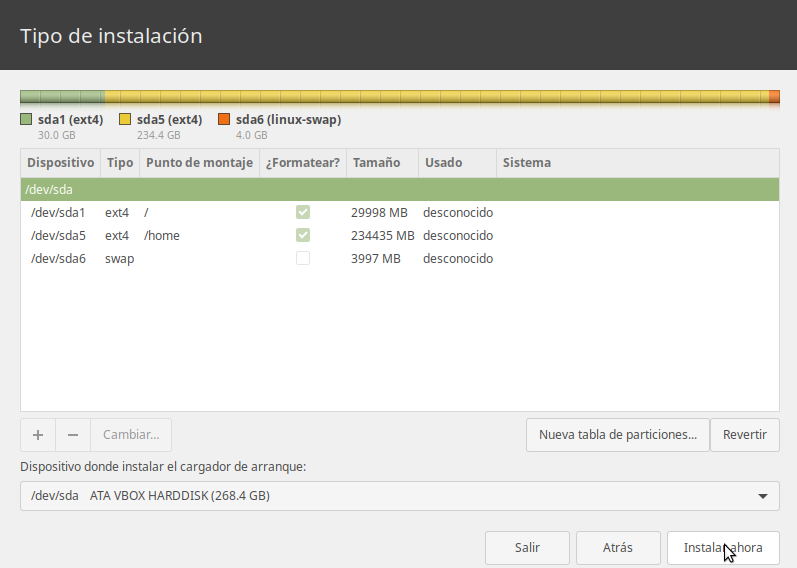
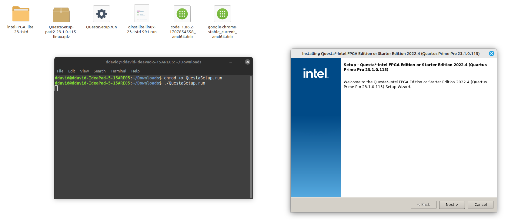

# Guía de Instalación de Linux

## Requisitos del Sistema

- Computadora 
- Unidad USB o DVD para la instalación
- Conexión a Internet (opcional pero recomendada para actualizaciones durante la instalación)
- Espacio suficiente en el disco duro para la instalación de Linux minimo 120GB




## Pasos de Instalación

1. **Descargar la Imagen de Linux**
   - Visita el sitio web oficial de la distribución de Linux que deseas instalar (por ejemplo, Ubuntu, Fedora, Debian).
   - Descarga la imagen de instalación (archivo ISO) adecuada para tu arquitectura de hardware (32 o 64 bits).

2. **Medio de instalación**
   - Si estás utilizando una unidad USB, utiliza un programa como Rufus (Windows) o dd (Linux) para crear un medio de arranque con la imagen ISO descargada.
   - Si estás utilizando un DVD, graba la imagen ISO en un DVD en blanco utilizando un software de grabación de discos.

3. **Comenzamos desde la pc**
   - Reinicia la computadora y accede al menú de configuración del BIOS/UEFI.
   - Configura el orden de arranque para que la unidad USB o el DVD sea la primera opción de arranque.

4. **Iniciar desde el Medio de Instalación**
   - Inserta la unidad USB o el DVD de instalación en tu computadora y reiníciala.
   - La computadora debería arrancar desde el medio de instalación que has creado.

5. **Iniciar el Proceso de Instalación**
   - Una vez que el medio de instalación haya cargado, selecciona la opción de instalar Linux en el menú de inicio.
   - Sigue las instrucciones en pantalla para seleccionar el idioma, la distribución de teclado y otros ajustes regionales.

6. **Particionar el Disco Duro**
   - Selecciona la opción de particionamiento manual si deseas personalizar la disposición de las particiones en tu disco duro.
   - De lo contrario, puedes elegir la opción de particionamiento automático para dejar que el instalador gestione las particiones por ti.

7. **Configurar el Usuario y la Contraseña**
   - Proporciona un nombre de usuario, contraseña y nombre de equipo para tu instalación de Linux.

8. **Completar la Instalación**
   - Una vez que hayas completado la configuración, el instalador comenzará a copiar los archivos necesarios y configurar tu sistema.
   - Espera a que el proceso de instalación termine.

9. **Reiniciar la Computadora**
   - Una vez que se complete la instalación, reinicia la computadora y retira el medio de instalación.
   - La computadora debería arrancar desde el disco duro y mostrar el sistema operativo recién instalado.

# Instalación de Quartus (para Altera)

## Descarga del Instalador
- Visita [enlace de descarga](enlace).
- Selecciona la versión "Lite edition" y haz clic en descargar.


## Cambiar Permisos y Ejecutar el Instalador
1. Abre la terminal en la carpeta del instalador.
2. Cambia los permisos del archivo con `chmod +x *.run`.
3. Ejecuta el instalador con `./nombre_del_archivo.run`.


## Instalación
- Selecciona todas las opciones mostradas en el instalador y haz clic en descargar.
- Una vez completada la instalación, encontrarás un acceso directo en el escritorio.

## Configuración de Acceso desde la Terminal
1. Edita el archivo `.bashrc` ubicado en `/home/usuario`.
2. Agrega las siguientes líneas al final del archivo:
   ```bash
   export ALTERAPATH="/home/usuario/intelFPGA_lite/23.1std/"
   export QUARTUS_ROOTDIR=${ALTERAPATH}/quartus
   export QUARTUS_ROOTDIR_OVERRIDE="$QUARTUS_ROOTDIR"
   export PATH=$PATH:${ALTERAPATH}/quartus/sopc_builder/bin
   export PATH=$PATH:${ALTERAPATH}/nios2eds/bin

# Tutorial para la herramienta de simulación Questa

## Descargar instalador
- Descargar los archivos Questa*-Intel® FPGA Edition (includes Starter Edition) del siguiente [link](enlace).
- Debe descargar tanto el archivo con extensión `.run` como la parte II que tiene extensión `.qdz` en el mismo directorio.
- Tenga en cuenta que la descarga de estos archivos tomará tiempo.
- Para el presente tutorial se descargó la versión 23.1.

## Instalación
- En la terminal de Linux:
  ```bash
  chmod +x nombre_archivo.run
  ./nombre_archivo.run




1. Se abrirá el instalador.
2. Dar clic en siguiente y seleccionar la opción Questa - Intel FPGA Starter Edition.
3. Dar clic en siguiente y aceptar los términos y condiciones.
4. Dar clic en siguiente y seleccionar la carpeta de destino de la instalación.
5. Dar clic en siguiente y revisar el resumen.
6. Dar clic en siguiente, con lo cual empezará la instalación.


# Descargar y Configurar la Licencia

1. Ingresar al Self-Service Licensing Center de Intel.
2. Inscribirse en la opción "Enroll for Intel® FPGA Self Service Licensing Center (SSLC)".
3. Loguearse en la opción "Already enrolled? - Sign In here (Intel Azure Portal)".
4. Seguir todos los pasos, uno de ellos consiste en escanear un código QR. En caso de no ser posible, usar la opción "I want to set up a different method", con la cual se enviará un código como mensaje de texto al número de celular que se ingrese.
5. Leer y aceptar términos de uso.
6. Una vez realizados los anteriores pasos, se abrirá una pestaña:
   - Ingresar a la opción "Sign up for Evaluation or No-Cost License".
   - Seleccionar la opción Questa*-Intel® FPGA Starter (ver imagen) y dar clic en siguiente.
7. Se abrirá una interfaz para generar la licencia.
8. Dar clic en +New Computer.
9. Diligenciar los campos requeridos:
   - En License type seleccionar FIXED.
   - En Computer type seleccionar NIC ID.
   - Para saber el Primary Computer ID:
     - En una terminal de Linux escribir el comando `ifconfig`.
     - El NIC ID corresponde al número de la mac del driver de wifi o ethernet, para wifi aparecerá en la opción wlp1s0 junto a la palabra ether.
     - Copiar todo el string que está separado por dos puntos ":", pero en la casilla Primary Computer ID borrarlos, es decir, sólo dejar caracteres alfanuméricos.
10. Dar clic en save, aceptar términos de uso y dar clic en generar.
11. Recibirán un correo con un archivo adjunto con extensión .dat correspondiente a la licencia.
12. Descargar la licencia en el directorio de instalación.

# Configuración en la IDE de Quartus

1. En el menú Tools abrir el License setup.
2. En la casilla License file cargar el archivo de la licencia .dat que acaban de generar.

# Configuración de Variables de Entorno de la Licencia

En el archivo .bashrc:

```bash
export LM_LICENSE_FILE=path_del_archivo/nombre_archivo.dat
